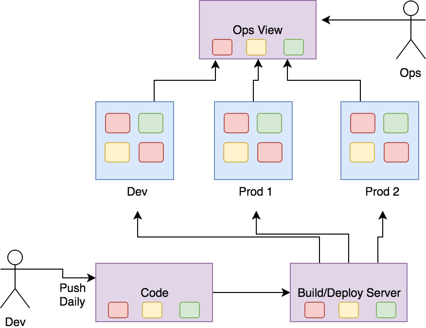

# 12 Factor

### Preface: Microservices and Cloud Platforms
Microservices will help solve some problems of monolithic applications: long release cycles, large amounts of technical debt and inefficient use of infrastucture. But its comes with a new set of problems such as deploying on distributed environments, support for rapid deployments, increased need for automation and the need for portability for your application. The problems are not to be taken lightly, but by making use of cloud platforms and following the 12-factor best practices, we can overcome some of these issues.

The following checklist is focused on a single app running in a microservice architecture in a cloud environment. This checklist is not a complete list of everything you need to know about microservices or cloud-native architectures, but it will eliminate a lot of the common anti-patterns, especially when migrating over from a monolithic applications.

This repo is written in Java and uses Docker, Kubernetes and Helm to complete this checklist. Feel free to apply 12-factor with any tools that you find useful.

Visualization of over-simplified microservice architecture:

### The 12-Factor Checklist
##### I. Codebase

Code for a single application should be in a single code base.

- [ ] All code changes to your application can be are tracked to a single codebase
- [ ] Use appropriate dependency management for your langauage for libraries shared between projects. For Java, Gradle or Maven are popular: [pom.xml](pom.xml)
- [ ] Version pin your dependencies so that things can't change under your feet between builds

##### II. Dependencies

Explicitly declare and isolate dependencies. Never rely on system dependencies.

- [ ] All dependencies are explicitly declared using a dependency declaration manifest such as a [Dockerfile](Dockerfile).
- [ ] Your app runs in isolation to prevent any system dependencies from being used accidently, such as in a Docker container.
- [ ] Dependencies are declared and isolated the same way for development and production environments.

 There are language specific options such as using a `Gemfile` as a manifest and `bundle exec` for isolation, but Docker is recommended as it enables container orchestration tools that solve distributed application problems that you will have when developing microservices.

##### III. Config

Store Config in the environment (not in the code).

- [ ] You only build once for deploys to all of your environments
- [ ] Configuration that changes between builds are passed into the app as environment variables. Options for passing include Docker `Config`, Kubernetes `ConfigMaps` and Helm `values.yaml`.
- [ ] Secrets are passed in using secure methods such as `Docker Secrets` or `Kubernetes Secrets` and no secrets are stored in version control

##### IV. Backing Services

Treat backing resources as attached services.

- [ ] Loose coupling between application code and backend resources. Example of using JPA metadata instead direct access to DB in application code: [here](src/main/resources/META-INF/persistence.xml)
- [ ] Externalize connection info into external config. Such as in helm [values.yaml](chart/liberty-starter/values.yaml)

##### V. Build, Release, Run

Strictly separate build and run stages.

- [ ] Builds are triggered via a code change. With microservices, this must be automated and this automation lives in source control with the app. Such as with a (JenkinsFile)[JenkinsFile]
- [ ] Builds result in a release with a unique release ID to be easily referenced in the "Run" stage. Example of a release would be a Docker Image, stored in a central registry (accessible in all environments), tagged with a release ID such as a build number or git commit hash.
- [ ] You can scale out/in an existing release, or rollback to a previous release without requiring a new build or release. This can be handled easily with a tool like Kubernetes.

##### VI. Processes

Execute app as stateless process

- [ ] Move state (sticky sessions) from within your app to an external service such as redis or cloudant.

##### VII. Port Binding

Export services via port binding. Apps should be self-contained.

- [ ] Embed runtime execution environments into the app. Such as with the `FROM websphere-liberty:webProfile7` in the [Dockerfile](Dockerfile)
- [ ] Expose service (such as HTTP) via a port and allow other apps by following `IV. Backing Services` factor. For this app, this is done via [server.xml](src/main/wlp/server.xml) and available for consumption by other services via the Kubernetes [service](chart/liberty-starter/templates/service.yaml).

##### VIII. Concurrency

Scale out via the process model

- [ ] Scale out by adding more instances of your application (horizontal scaling) rather than adding more resources (vertical scaling). This is done in Kubernetes by increasing the number of replicas in the [deployment.yaml](chart/liberty-starter/templates/deployment.yaml) or by using the `kubectl scale` command
- [ ] The process for your application is a first-class citizen for your deployment platform. Containers are just processes. If your app is running as PID 1, you can ensure that Kubernetes or Swarm can manage and scale that process like any other.

##### IX. Disposability

Maximize robustness with fast startup and graceful shutdown

- [ ] Minimize startup times. Startup times can be reduced by using Docker and taking advantage of its built in layering system. Also consider lazy-loading or other practices to reduce times.
- [ ] Handle SIGTERM events sent to your application. With Docker you can test by running `docker run` without the `-d` flag, and typing `ctrl+c` in your console to see how your container shuts down.
- [ ] Implement graceful shutdown. Mark service as offline (no more new requests), complete existing requests, then remove services. In Kubernetes, this happens for your [automatically](https://kubernetes.io/docs/concepts/workloads/pods/pod-lifecycle/)
- [ ] Your app is robust against sudden death. There is no data loss if your app suddenly stops running.

If using Kubernetes, you can also take advantage of [container lifecycle hooks](https://kubernetes.io/docs/concepts/containers/container-lifecycle-hooks/) and define your own [container probes](https://kubernetes.io/docs/concepts/workloads/pods/pod-lifecycle/#container-probes) to improve robustness.

##### X. Dev/Prod Parity

Keep development, staging and production as similar as possible

- [ ] See "II. Dependencies"
- [ ] Use the same tools in dev as what is used in production. For example, no developer-specific tools such as SQLite or lightweight db adapaters for development. Utilize Docker for easy local install.
- [ ] Eliminate the "personnel gap". Have developers be involved with the production deployment
- [ ] Eliminate the "time gap". Release code that was written within hours later instead of days or weeks.

##### XI. Logs

Treat logs as event streams

- [ ] Write logs standard out
- [ ] In non-local/dev environments, centralize logs from multiple replicas (see VIII.) in a single UI. Such as by implementing the ELK stack.
- [ ] Filter logs to find relevant historical information quickly
- [ ] Don't delete or rotate logs. Keep log data for future analytics

In addition to the "bare-minimum" requirements above, you should be able to take advantage of a tool like Grafana or Splunk to provide you with the following
- [ ] Notifications to developers when a message appears or threshold of messages have been met
- [ ] Run analytics for data-driven decisions

##### XII. Admin Processes

Run admin/management tasks as one-off processes. Same environment as running applications

- [ ] Run one-off scripts (such as a database backup) in same environment and configuration as the application. This can be done with Docker using the `docker exec` or `kubectl exec` commands.
- [ ] Store admin scripts in same version control as the app to avoid synchonization issues

### Other resources to help
[Do you have microservices? Or do you just have distributed balls of mud](http://www.codingthearchitecture.com/2014/07/06/distributed_big_balls_of_mud.html)

[Designing microservice boundaries with bounded context](https://martinfowler.com/bliki/BoundedContext.html)
